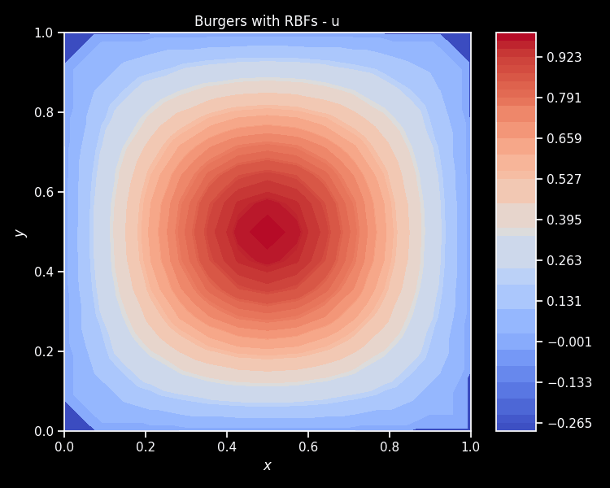
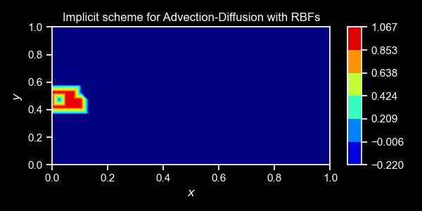

# 𝕌pdes

𝕌pdes is a general-purpose library for mesh-free PDE simulation and control. __𝕌pdes__ stands for Universal(__𝕌__) Partial Differential Equations (__PDE__) Simulator(__S__). There is no faster way to run your PDE than to use Updes !


## Features
𝕌pdes is equipped with the following features:
- User-centric design: no need to re-implement a solver for each new PDE
- Lightning fast mesh-free simulation via Radial Basis Functions
- Robust differentiable simulation via JAX, and portable across CPU, GPU, and TPU
- Support for Dirichlet, Neumann, Robin, and Periodic boundary conditions
- Automatic generation of normals from 2D GMSH meshes

𝕌pdes in incredibly extendable, and additional features will be added soon.


## Getting started
The package is available on PyPi. You can install it with
```
pip install Updes
```

The example below illustrates how to solve the Laplace equation with Dirichlet and Neumann boundary conditions:
```python
from updes import *
import jax.numpy as jnp

## Boundary condition type for each side of the square
facet_types={"South":"n", "West":"d", "North":"d", "East":"d"}

## Create a mesh-free square cloud of points
cloud = SquareCloud(Nx=30, Ny=20, facet_types=facet_types)

## Define the differential operator (left-hand side of the PDE)
def my_diff_operator(x, center=None, rbf=None, monomial=None, fields=None):
    return nodal_laplacian(x, center, rbf, monomial)

# Define the right-hand side of the PDE
def my_rhs_operator(x, centers=None, rbf=None, fields=None):
    return 0.0

## Set a sin function as the Dirichlet BC on the North, and zero everywhere else
d_north = lambda coord: jnp.sin(jnp.pi * coord[0])
d_zero = lambda coord: 0.0
boundary_conditions = {"South":d_zero, "West":d_zero, "North":d_north, "East":d_zero}

## Solve the Laplace equation with a JIT-compiled solver
sol = pde_solver_jit(diff_operator=my_diff_operator, 
                    rhs_operator = my_rhs_operator, 
                    cloud = cloud, 
                    boundary_conditions = boundary_conditions, 
                    rbf=polyharmonic,
                    max_degree=1)

## Visualize the solution
cloud.visualize_field(sol.vals, cmap="jet", projection="3d", title="RBF solution");
```

𝕌pdes can handle much complicated cases with little to no modifications to the code above. Check out further notebooks and scripts in the documentation and the folder [`demos`](./demos)!

<!-- |  |  |  | -->

|  |  |  |


## To-Dos
- Logo, licence, contributors guide, and developer documentation
- Better introductory examples and user documentation for outreach
    - Integration with Neural Networks and Equinox
    - Non-linear and multi-dimensional PDEs
    - Adjoint schemes for fluid flows
- Better cloud points generation with accurate geometry and normals: 
    - USD format
    - Gmsh tutorial
- Add support for 3D radial basis functions

We welcome contributions from the community. Please feel free to open an issue or a pull request.


## Dependencies
- **Core**: JAX - GMSH - Matplotlib - Seaborn - Scikit-Learn
- **Optional**: PyVista - FFMPEG - QuartoDoc

See the `pyproject.toml` file the specific versions of the dependencies.


## Cite us
If you use this software, please cite us with the following BibTeX entry:
```
@inproceedings{nzoyem2023comparison,
  title={A comparison of mesh-free differentiable programming and data-driven strategies for optimal control under PDE constraints},
  author={Nzoyem Ngueguin, Roussel Desmond and Barton, David AW and Deakin, Tom},
  booktitle={Proceedings of the SC'23 Workshops of The International Conference on High Performance Computing, Network, Storage, and Analysis},
  pages={21--28},
  year={2023}}
```
