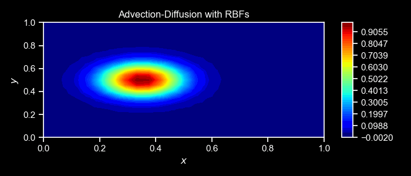
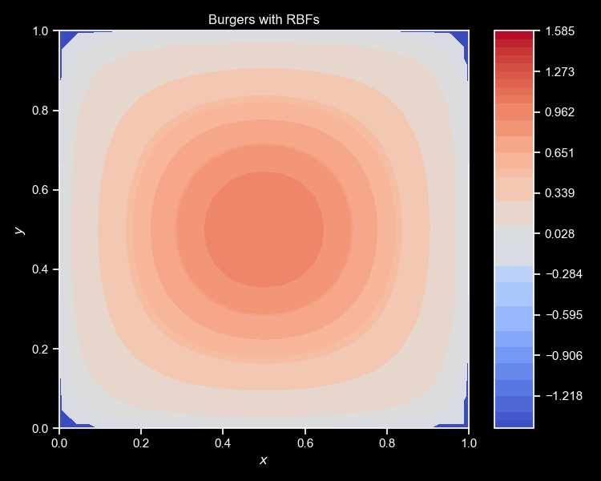
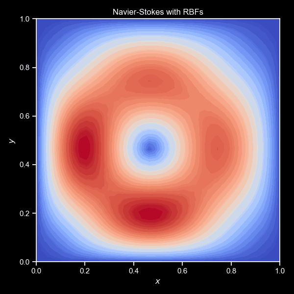

# 𝕌pdes

𝕌pdes is a general-purpose library for mesh-free PDE simulation and control. There is no faster way to explore the realm of PDEs !

<table>
  <tr>
    <th></th>
    <th></th>
    <!-- <th></th> -->
    <th></th>
  </tr>
</table>


## Features
𝕌pdes leverages Radial Basis Functions (RBFs) and JAX to provide the following features:
- User-centric design: no need to re-implement a solver for each new PDE
- Lightning fast mesh-free simulation via Radial Basis Functions
- Robust differentiable simulation via JAX, and portable across CPU, GPU, and TPU
- Support for Dirichlet, Neumann, Robin, and Periodic boundary conditions
- Automatic generation of normals from 2D GMSH meshes

𝕌pdes is easily extendable, with additional features added frequently.


## Getting started
The package is available on PyPI. You can install it with
```
pip install updes
```

The example below illustrates how to solve the Laplace equation with Dirichlet and Neumann boundary conditions:
<p align="center">

</p>

```python
import updes
import jax.numpy as jnp

# Create a mesh-free cloud of points on a unit square
facet_types={"South":"n", "West":"d", "North":"d", "East":"d"}
cloud = updes.SquareCloud(Nx=30, Ny=20, facet_types=facet_types)

# Define the differential operator (left-hand side of the PDE)
def my_diff_operator(x, center, rbf, monomial, fields):
    return updes.nodal_laplacian(x, center, rbf, monomial)

# Define the right-hand side of the PDE
def my_rhs_operator(x, centers, rbf, fields):
    return 0.0

# Set a sin function as the Dirichlet BC on the North, and zero everywhere else
sine = lambda coord: jnp.sin(jnp.pi * coord[0])
zero = lambda coord: 0.0
boundary_conditions = {"South":zero, "West":zero, "North":sine, "East":zero}

# Solve the Laplace equation with a JIT-compiled solver
sol = updes.pde_solver_jit(diff_operator=my_diff_operator, 
                    rhs_operator=my_rhs_operator, 
                    cloud=cloud, 
                    boundary_conditions=boundary_conditions, 
                    rbf=updes.polyharmonic,
                    max_degree=1)

# Visualize the solution
cloud.visualize_field(sol.vals, cmap="jet", projection="3d", title="RBF solution")
```

𝕌pdes can handle much complicated cases with little modifications to the code above. Check out the [documentation](https://ddrous.github.io/Updes/) and Python interactive notebooks in the [`demos`](./demos) folder !


## To-Dos
1. Logo, contributors guide, and developer documentation
2. Improved ill-conditioned linear systems for RBF-FD (i.e. `support_size != "max"`)
2. More introductory examples in the documentation :
    - Integration with neural networks and [Equinox](https://github.com/patrick-kidger/equinox)
    - Non-linear and multi-dimensional PDEs
    - Adjoint schemes for fluid flows
3. Better point generation with accurate geometry and normals: 
    - USD format
    - GMSH tutorial
4. Support for 3D radial basis functions

We welcome contributions from the community. Please feel free to open an issue or a pull request.


## Dependencies
- **Core**: [JAX](https://github.com/google/jax) - [GMSH](https://pypi.org/project/gmsh/) - [Lineax](https://github.com/patrick-kidger/lineax) - [Matplotlib](https://github.com/matplotlib/matplotlib) - [Seaborn](https://github.com/mwaskom/seaborn) - [Scikit-Learn](https://github.com/scikit-learn/scikit-learn)
- **Optional**: [PyVista](https://github.com/pyvista/pyvista) - [FFMPEG](https://github.com/kkroening/ffmpeg-python) - [QuartoDoc](https://github.com/machow/quartodoc/)

See the `pyproject.toml` file the specific versions of the dependencies.


## Cite us !
If you use this software, please cite us with the following BibTeX entry:
```
@inproceedings{nzoyem2023comparison,
  title={A comparison of mesh-free differentiable programming and data-driven strategies for optimal control under PDE constraints},
  author={Nzoyem Ngueguin, Roussel Desmond and Barton, David AW and Deakin, Tom},
  booktitle={Proceedings of the SC'23 Workshops of The International Conference on High Performance Computing, Network, Storage, and Analysis},
  pages={21--28},
  year={2023}}
```
